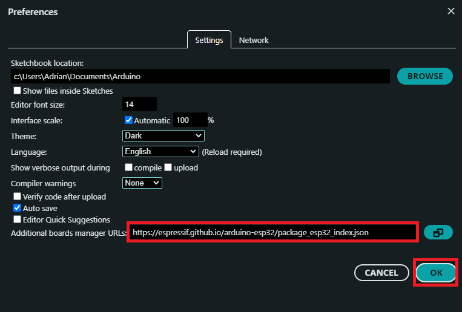
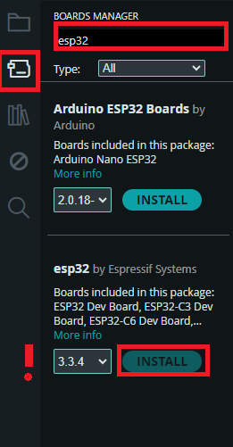
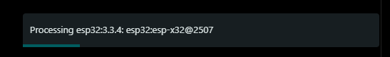
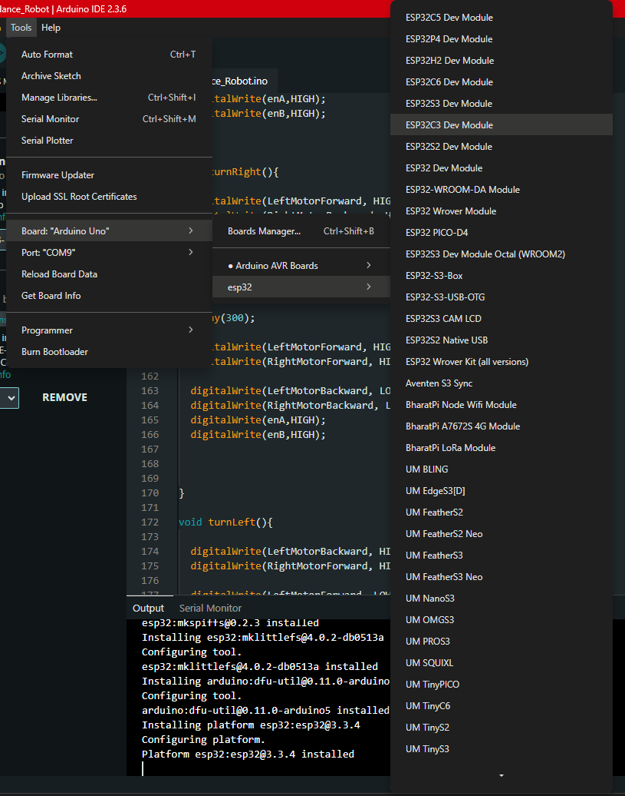
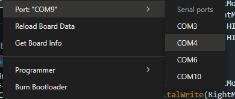

# Tutorial connecting ESP32 to Arduino IDE

# 1.Download Arduino IDE if you don't have it yet. 
https://www.arduino.cc/en/software/

# 2.Adding an additional board manager

-> Open File -> Preferences
A window will open where you will find "Additional Board manager URL."

Paste "https://espressif.github.io/arduino-esp32/package_esp32_index.json"

Click Ok

# 3.Install ESP32 Boards

Click on the board manager button on the left and search for "Esp32." Install the library from Espersif.

Wait for the Board to install

# 4.Pick ESP32

Tools -> Board -> esp32 -> Esp32C3 Dev Module(or the board you use)

# 5.Pick the port

Tools -> Port -> Choose the COM port your ESP32 is conected to

# Finnished XD
