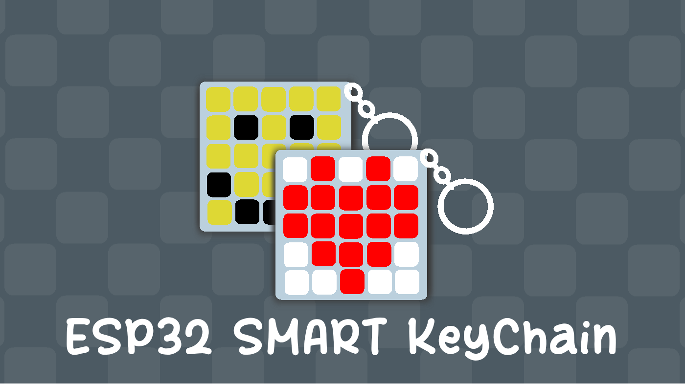
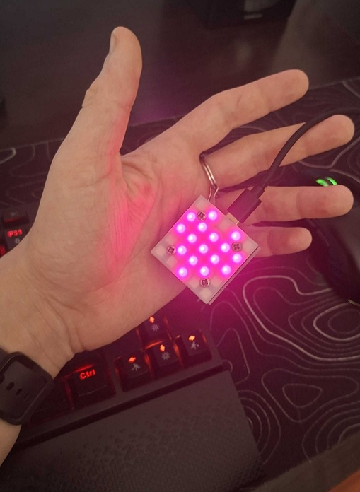
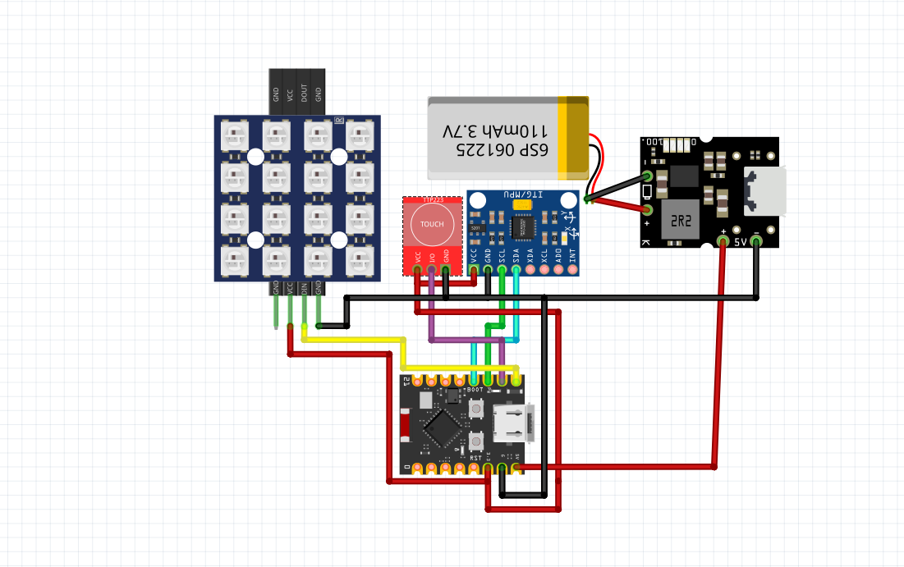

# Esp32-KeyChain
Smart Esp32 KeyChain with 5x5 RGB Led Matrix
Very funny and cool for your backpack :3

- I created this for my backpack and it is very nice, you can customize it 

# Components
- Microcontroller: ESP32-C3 (DevKitC)
- Charging Module: TP4056 USB-C Boost Module (All-in-One 5V Boost)
- Battery: Li-ion / LiPo 3.7V (150mAh)
- Accelerometer: MPU-6050 (GY-521)
- Touch Sensor: TTP223 (TTP223-AM)
- LED Matrix: WS2812B Matrix (5×5)
- 4x Screw 
- 4x Screw Holder
- 4x Nuts
- 1 Sheet of semi transparent paper

# Schematics

# The Firmware is located in the `./CAD/Firmware/`

# Customize Network and Site 

Modify: 
Line 10 in the quotes for the Wifi Name
Line 11 in the quotes for the Wifi Password
Line 850 and 993 for the site title

