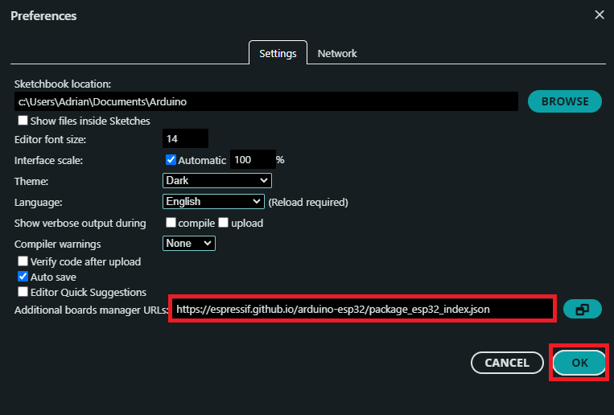
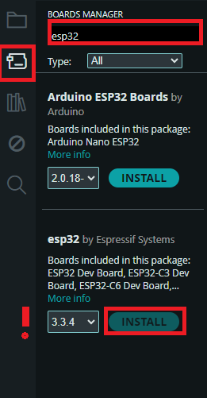
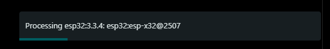
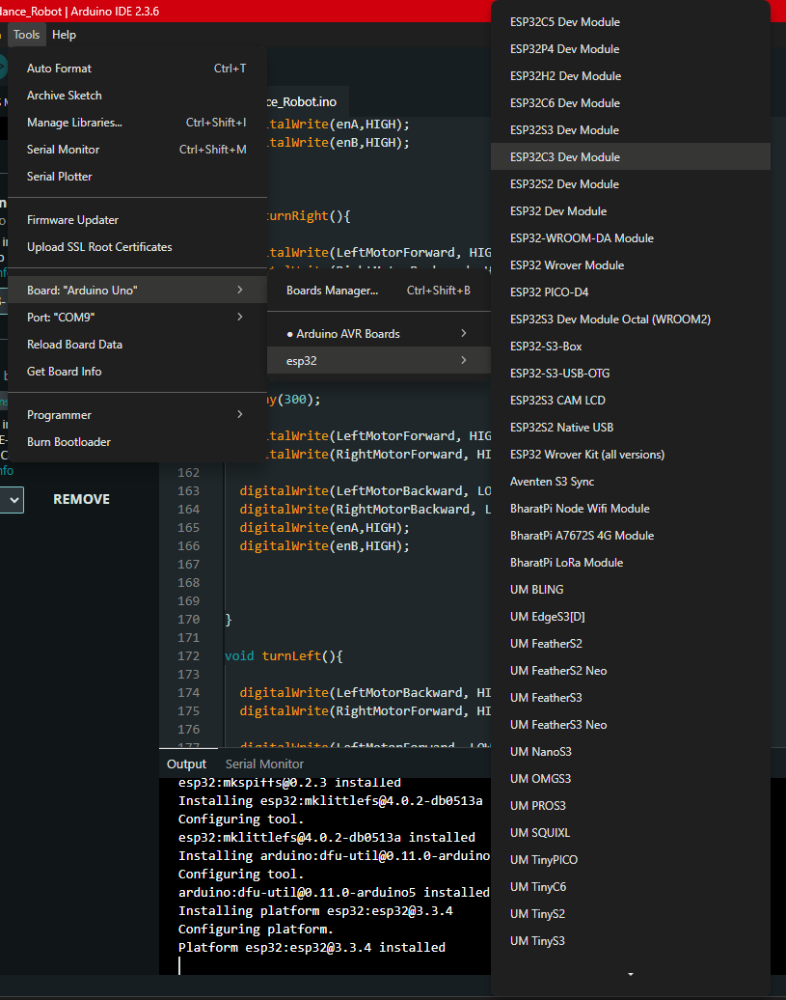
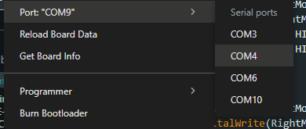
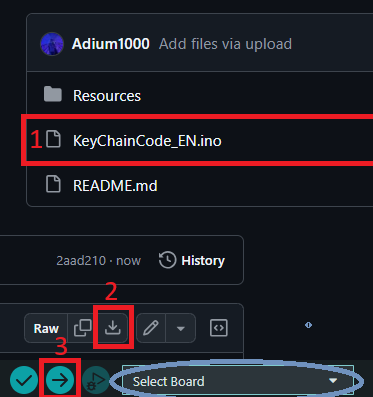
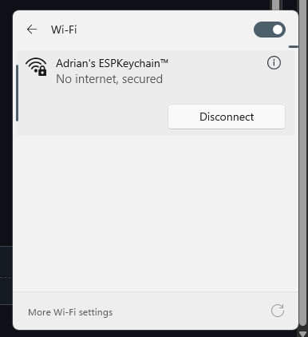
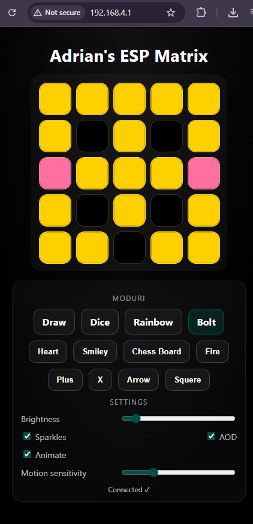

# Esp32-KeyChain
Smart Esp32 KeyChain with 5x5 RGB Led Matrix

# Version 1

Main idea:
A smart keychain capable of displaying emotions on a 5x5 grid and turning on automatically thanks to the GY 521 sensor. We have also integrated a touch button for automatic Bluetooth activation, and in the future we will add a mini speaker to the next design.

# Components
Microcontroller: ESP32-C3 (DevKitC)

Charging Module: TP4056 USB-C Boost Module (All-in-One 5V Boost)

Battery: Li-ion / LiPo 3.7V (500mAh)

Accelerometer: MPU-6050 (GY-521)

Touch Sensor: TTP223 (TTP223-AM)

LED Matrix: WS2812B Matrix (5×5)

# Quick Guide

# 1 Setup ESP32 (C3) to Arduino IDE

# 1.Download Arduino IDE if you don't have it yet. 
https://www.arduino.cc/en/software/

# 2.Adding an additional board manager

-> Open File -> Preferences
A window will open where you will find "Additional Board manager URL."

Paste "https://espressif.github.io/arduino-esp32/package_esp32_index.json"

Click Ok

# 3.Install ESP32 Boards

Click on the board manager button on the left and search for "Esp32." Install the library from Espersif.

Wait for the Board to install

# 4.Pick ESP32

Tools -> Board -> esp32 -> Esp32C3 Dev Module(or the board you use)

# 5.Pick the port

Tools -> Port -> Choose the COM port your ESP32 is conected to

# 6 Upload the code

Download the INO file, select your board and click the right arrow to upload
# 7 Use the components mentioned above to form this diagram.

# 8 Configuration tool
The code you uploaded to your palette creates a website where you can modify certain aspects of the keychain.
To acces that
-Connect to "Adrian's KeyChain™"

-Open ANY browser and tipe in the URL bar: "192.168.4.1" because is a local site 

-And Done, here you can customize the KeyChain

# Customize Network and Site 

Modify: 
Line 10 in the quotes for the Wifi Name
Line 11 in the quotes for the Wifi Password
Line 850 and 993 for the site title

